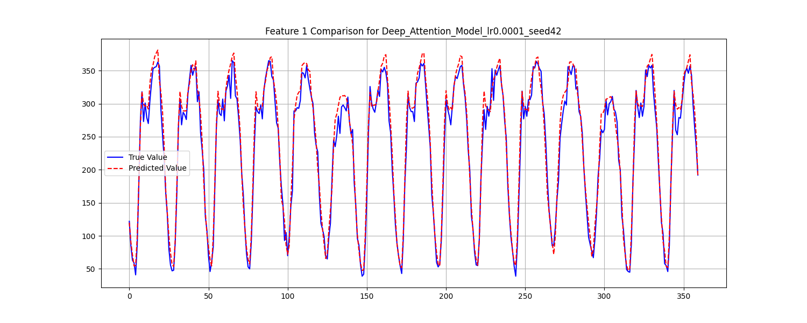
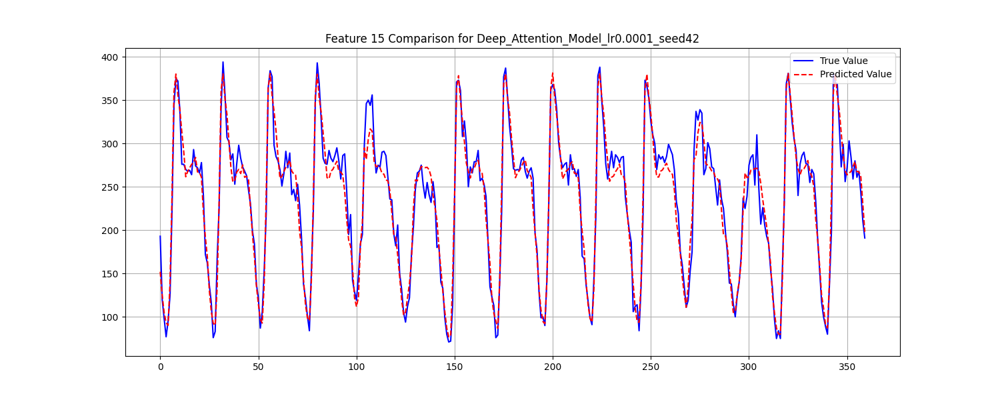
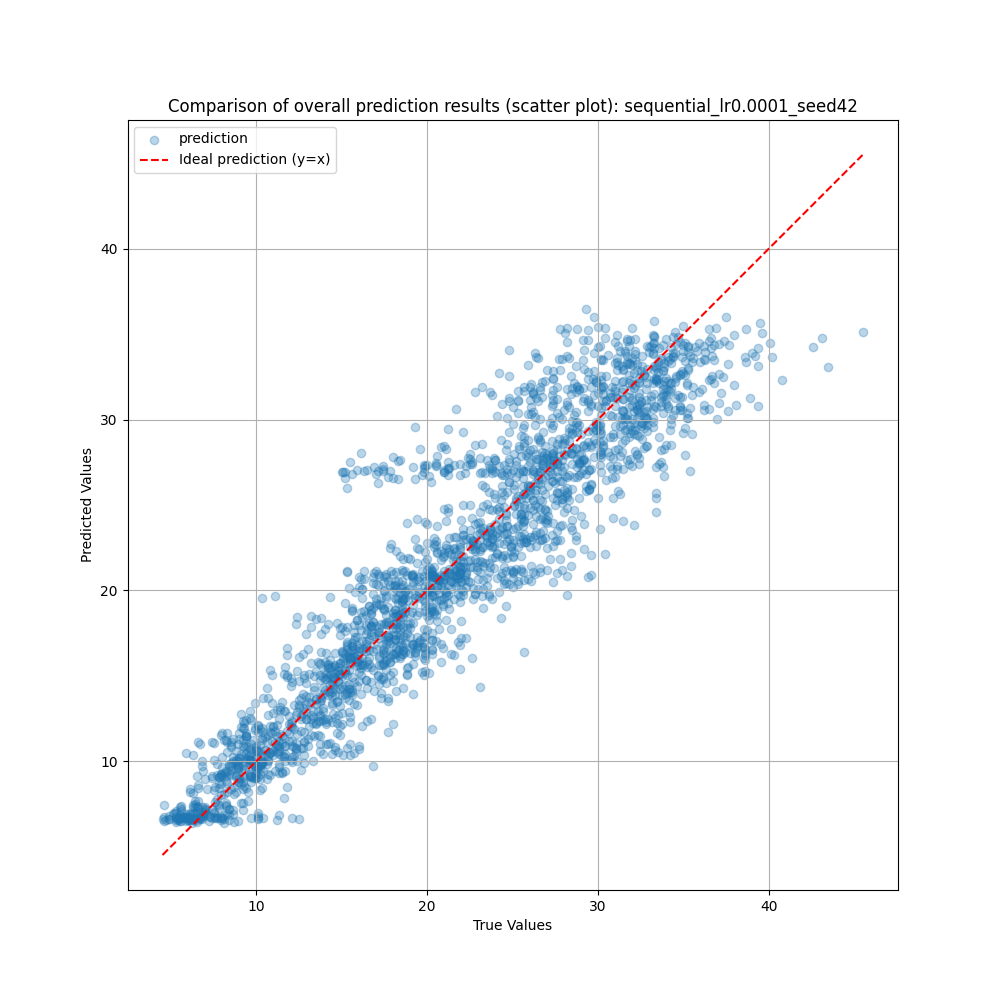
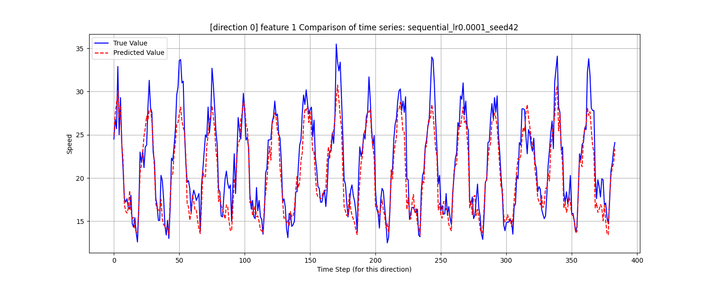
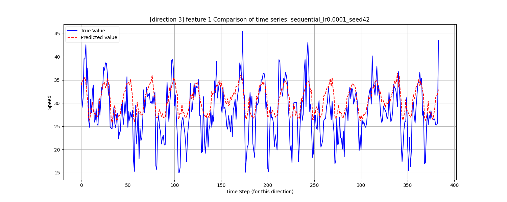

<div align="center">
<h1 align="center">🚦 Composite Model for Traffic Signal Control</h1>

<h3>Optimal Traffic Signal Control for an Atypical Isolated Intersection Using Composite Analysis Model</h3>
<br/>
</div>

## 📝 Project Overview

This project presents a hierarchical framework designed to optimize urban traffic signal control by integrating advanced machine learning models. The system leverages a Recurrent Neural Network (RNN-LSTM) to forecast future traffic volumes, a Deep Neural Network (DNN) to predict vehicle speeds under various signal timings, and a Genetic Algorithm (GA) to discover the optimal signal plan. The ultimate goal is to alleviate traffic congestion and enhance the overall efficiency of traffic management systems. The methodology is validated using data from the Yeonsan Intersection in Busan, with final performance verification intended for a VISSIM simulation environment.

## 🔑 Key Features
- Hierarchical Modeling: A multi-stage process where the output of one model serves as the input for the next, creating a comprehensive decision-making pipeline (LSTM → DNN → GA).

- Predictive Control: Proactively adjusts signal timings based on traffic volume predicted one hour in advance.

- Efficient Optimization: Utilizes a DNN as a fast and effective surrogate model to evaluate the fitness of countless signal combinations, making large-scale optimization with a Genetic Algorithm feasible.

- Modular Codebase: The project is structured into distinct modules for traffic_volume prediction and traffic_speed estimation, allowing for independent development and testing.

- Data-Driven: Trained and validated on real-world traffic data collected from a smart intersection project.

## 🧩 Requirements
- Python 3.8+
- Tensorflow
- Pandas
- NumPy
- Scikit-learn
- Matplotlib

### 🍳 Installation
Clone the repository:

```bash
git clone [https://github.com/seunghyeokleeme/Composite-Model-Traffic-Control.git](https://github.com/seunghyeokleeme/Composite-Model-Traffic-Control.git)

cd Composite-Model-Traffic-Control
```

Create and activate a virtual environment (recommended):

### Using python's built-in venv

```bash
python -m venv venv
source venv/bin/activate  # On Linux/Mac
.\venv\Scripts\activate   # On Windows
```

Install the required packages:

```bash
pip install tensorflow pandas numpy scikit-learn matplotlib ...
```

## 💿 Dataset
This project utilizes real-world data from the 2023 Yeonsan Intersection Smart City Project. The data is divided into two main categories: traffic volume and traffic speed.

- Traffic Volume Data: `data/traffic_volume/`

    `traffic_volume.csv`: Directional traffic volume data.

    `traffic volume timestemp.csv`: Timestamped version of the directional traffic volumes.

- Traffic Speed Data: `data/traffic_speed/`

    `dnn_train.csv`: Training data for the DNN model, containing features like predicted traffic volume, signal timings, and corresponding vehicle speeds.

The expected directory structure is:

```
├── data/
│   ├── traffic_speed/
│   │   └── dnn_train.csv
│   └── traffic_volume/
│       ├── traffic_volume.csv
│       └── traffic_volume_timestemp.csv
├── traffic_speed/
│   ├── train.py
│   └── eval.py
└── traffic_volume/
    ├── make_data.py
    ├── train.py
    └── eval.py

```

## 🚀 How to Run
The project is executed in stages, following the hierarchical model structure.

1. Prepare Traffic Volume Data
This script processes the raw traffic volume CSV files into a format suitable for training the LSTM model.

```bash
python ./traffic_volume/make_data.py
```

2. Train the Traffic Volume Prediction Model (LSTM)
Train the Bidirectional LSTM with Attention model to predict traffic volumes for the next hour.

```bash
python ./traffic_volume/train.py \
    --lr 1e-4 --seed 42 \
    --epochs 100
```

3. Train the Vehicle Speed Prediction Model (DNN)
After generating traffic volume predictions, train the DNN surrogate model. This model learns to predict average vehicle speed based on traffic conditions and candidate signal timings.

```bash
python ./traffic_speed/train.py \
    --lr 1e-4 --seed 42 \
    --epochs 150
```

4. Evaluate Models
Evaluate the performance of the trained models using the respective eval.py scripts.

### Evaluate LSTM model

```bash
python ./traffic_volume/eval.py
```

### Evaluate DNN model

```bash
python ./traffic_speed/eval.py
```

## 🧪 System Architecture & Methodology

The core of this project is a hierarchical framework that models the complex problem of traffic control as a sequence of manageable tasks.

Key Modules
Spatio-Temporal Traffic Flow Prediction (RNN-LSTM): This module uses a Bidirectional LSTM with an attention mechanism to accurately forecast future traffic demand. By learning from both past and future contexts in the time-series data, it provides a rich understanding of traffic patterns, which is crucial for proactive control.

Surrogate Model for Velocity Estimation (DNN): To efficiently evaluate the effectiveness of thousands of potential signal plans generated by the GA, we use a deep neural network as a surrogate model. It rapidly approximates the average vehicle speed for a given traffic demand and signal timing, replacing computationally expensive microscopic simulations.

Evolutionary Signal Optimization (GA): Leveraging the DNN as its fitness function, a Genetic Algorithm searches the vast solution space for the optimal signal vector s*. It mimics natural selection by iteratively refining a population of candidate solutions through selection, crossover, and mutation, ultimately converging on a signal plan that maximizes traffic flow.

## Problem Formulation
The objective is to solve a Constrained Stochastic Optimization Problem. We aim to find the optimal signal vector s* that maximizes the expected average vehicle speed E in the next time interval t+1, given all historical data Dt and subject to real-world operational constraints S.

$$
s^{*} = \arg\max_{s \in \mathcal{S}} \mathbb{E}[\mathcal{E}(t+1)|D_{t},s]
$$

## 📈 Results
The performance of each model is saved to the `results` directory after running the evaluation scripts.

### Volume Prediction Results: `results/traffic_volume`

test_results_Deep_Attention_Model_lr0.0001_seed42.csv

- feature 1 traffic volume



- feature 15 traffic volume



### Speed Prediction Results: `results/traffic_speed/`

test_results_sequential_lr0.0001_seed42.csv

- Overall Scatter Speed Prediction



- direction 0 feature trend



- direction 3 feature trend



These files contain the model's predictions alongside the ground truth values, allowing for detailed performance analysis (e.g., calculating MAE, RMSE).

📜 Reference
This project is based on the methodology outlined in the following documents:

...